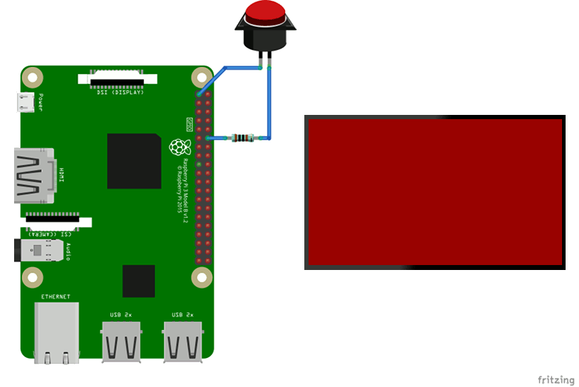

# Analog Sensor via GPIO package

info-beamer OS (from version 10) has support for GPIO access. The
[package sdk](https://github.com/info-beamer/package-sdk)
makes it easy to read GPIO values from your Python
[package service](https://info-beamer.com/doc/package-services).
This package demonstrates this in a minimal way: Pressing a
physical button toggles the screen color from red to green.
Here's the wiring you'll need and how it works:



The button connects the 3.3V output PIN to GPIO18 of your Pi
via a 1KΩ resistor.

[](https://info-beamer.com/use?url=https://github.com/info-beamer/package-gpio-demo)

## How this package works

All
[info-beamer packages](https://info-beamer.com/doc/building-packages)
contain multiple files that together control
how to
[configure a package](https://info-beamer.com/doc/package-reference#nodejson),
how it runs
[background tasks](https://info-beamer.com/doc/package-services)
on a device and what is
[shown on the screen](https://info-beamer.com/doc/info-beamer).
Here's all files needed for the GPIO demo.

### node.json file

This package only has a single configuration option named `pin`.
The follow snippet shows the complete
`node.json` file ([reference documentation](https://info-beamer.com/doc/package-reference#nodejson)).

```json
{
    "name": "GPIO Demo",
    "permissions": {
        "gpio": "Access GPIO"
    },
    "options": [{
        "title": "PIN",
        "ui_width": 4,
        "name": "pin",
        "type": "integer",
        "default": 18
    }]
}
```

It specifies that this node wants access to 
[gpio](https://info-beamer.com/doc/package-reference#nodepermissions)
and defines a
[configuration option](https://info-beamer.com/doc/package-reference#options)
named `pin` as an
[integer](https://info-beamer.com/doc/package-reference#optioninteger)
with a default value of `18`.

### service file

The package service, bundled as the file `service` in this package,
looks like this:

```python
#!/usr/bin/python
from hosted import device, node, config
config.restart_on_update()

device.gpio.monitor(config.pin)
for pin, state in device.gpio.poll_forever():
    node.send('/state:%d' % state)
```

This file is executed on any device you install this package on. It
runs forever and is automatically restarted by the info-beamer OS
if it terminates for any reason.
The code imports the
[info-beamer package sdk](https://github.com/info-beamer/package-sdk)
from `hosted.py`. The `config` class will automatically be populated with
the configuration values set by the user. Right now only `pin` can be
configured and the value set by the user is available in `config.pin`.

The `config.restart_on_update()` line tells the package sdk to
automatically restart the service every time the configuration changes.
So if the user changes the PIN value from 18 to (for example) 17, the
Python process will exit and is automatically restarted by the
info-beamer OS.

Next we set up a GPIO monitor for the configured PIN using the
`device.gpio.monitor` call. The _for_ loop then forever loops and
returns a new observation in every loop.

Inside the loop we get a `state` value each time. `True` if GPIO is
high, `False` if it is low. We immediately send this value to the
running info-beamer code in `node.lua` (see below). Since we convert
the boolean state value to a numeric value with `%d` it is converted
to either `1` or `0`. The `node.send` call internally sends a UDP packet
to the info-beamer process with the following content assuming this
package is the top-level node (/root) in your setup:

```
/root/state:0
```
or
```
/root/state:1
```

### node.lua

The node.lua file is responsible for controlling the content of the screen.
Here's the complete file:

```lua
gl.setup(NATIVE_WIDTH, NATIVE_HEIGHT)

local on = false

util.data_mapper{
    state = function(state)
        on = state == '1'
    end,
}

function node.render()
    if on then
        gl.clear(0, 1, 0, 1) -- green
    else
        gl.clear(1, 0, 0, 1) -- red
    end
end
```

The variable `on` decides if we clear the screen in green or red: You can see
how this decision is made in the `node.render` function at the bottom. The
`node.render` function is usually called 60 times per second and is responsible to
creating the screen outout.

The [util.data_mapper](https://info-beamer.com/doc/info-beamer#utildatamapperroutingtable)
receives incoming UDP packets (remember we send them in the package service above)
and decides how to react the them. The value `state` matches to the `node.send` call
from above. Its callback function receives the value sent: In our case we sent
either `0` or `1` (see above). So we test for that and update the `on` variable accordingly.

That's all. You can install this package on your info-beamer devices and can see how
the screen turns green while the button is pressed.
